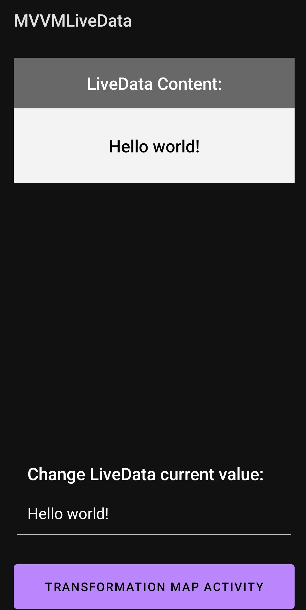
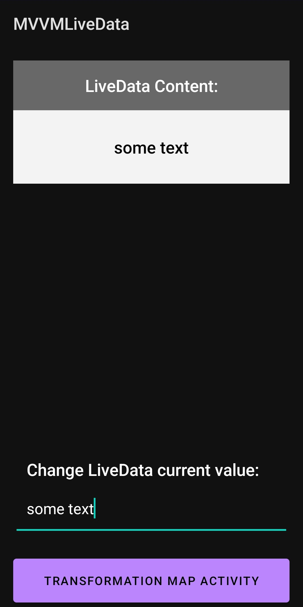
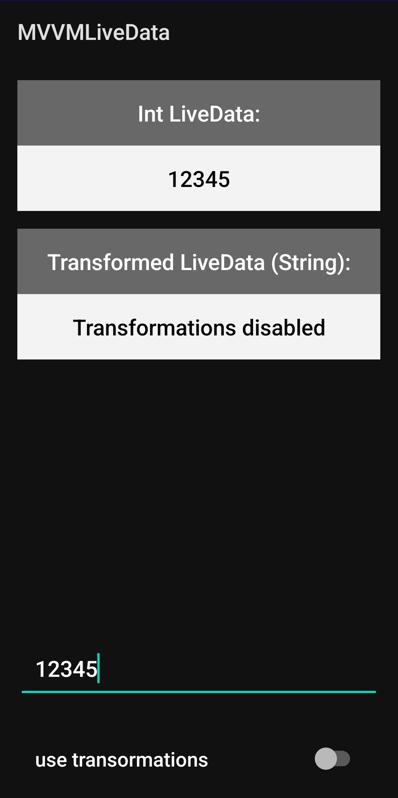
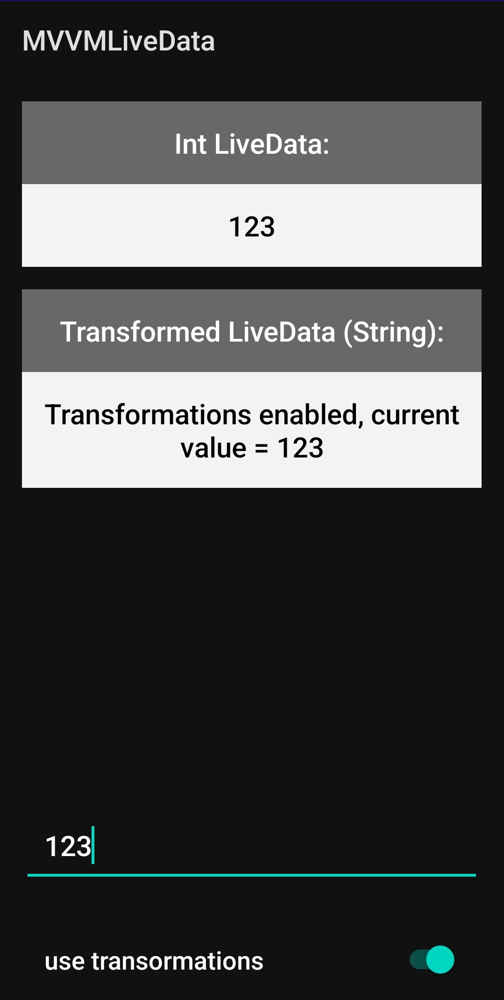

# Приложение, использующее возможности класса LiveData
## Функциональность

Приложение состоит из 2-х Activity.
* На первом Activity реализовано автоматическое обновление данных в LiveData в соответствии с содержимым поля ввода
* На втором Activity реализована функциональность преобразования исходного LiveData\<Int> в LiveData\<String> при помощи класса Transformations

## Скриншоты
### Activity 1

    
    

 

### Activity 2

    
    
    

